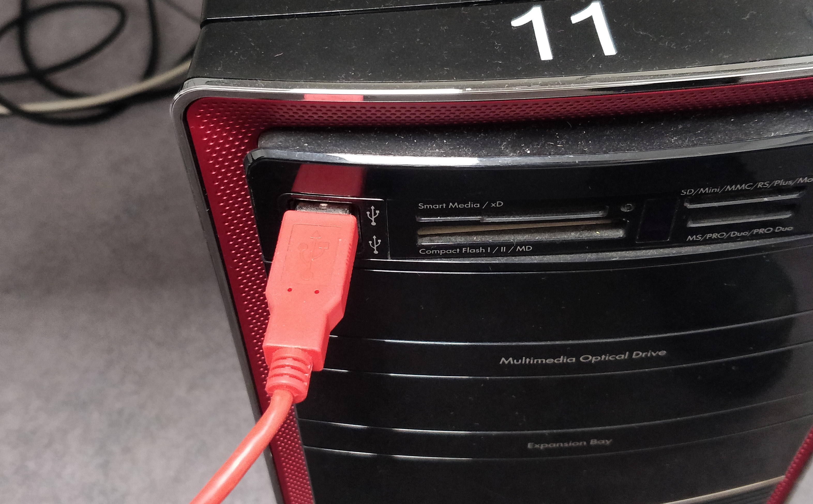
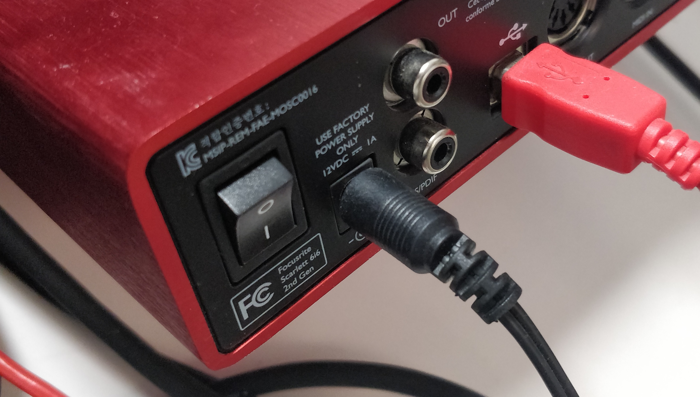
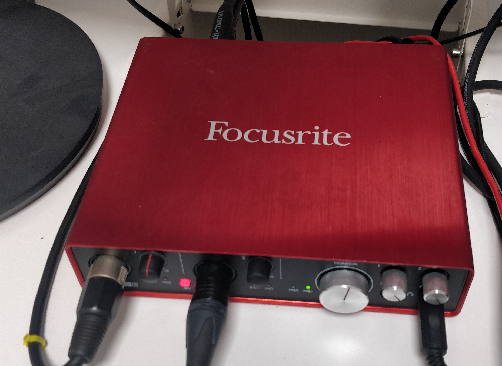

# Prise2son_2spi

Pré-requis : être dans le studio son.

## 1. Branchements

La carte son doit être branchée à l'ordi :

Elle doit être allumée :

Et il doit y avoir des trucs branchés dessus : 

## 2. Réglages FL Studio

Ouvrir FL Studio.

Ouvrir les `Audio Settings` dans la liste `Options`.

Dans la liste `Device`, sélectionner notre carte son `Focusrite USB ASIO`.

*Attention à bien prendre la Focusrite dans la partie `Asio Device` de la liste.*

Voilà l'interface quand tout est bien connecté :

## 3. Enregistrement

Cliquer sur l'icône micro en haut à droite.

Choisir `Into Edison audio editor/recorder`.

Cliquer sur le bouton enregistrer ⏺️ pour commencer l'enregistrement.

Le bouton enregistrer ⏺️ devient rouge, et on peux cliquer sur le bouton stop ⏹️ pour arrêter.

Pour sauvegarder l'enregistrement, cliquer sur le bouton disquette 💾 et choisir `Save sample as`.

Pour créer un nouvel enregistrement, cliquer sur le bouton disquette 💾 et choisir `New`.

