# Prise2son_2spi

*[english version](https://github.com/LucieMrc/SoundRecording_sp33d)*

**Ou comment faire une prise de son en autonomie pour les voix-off, les podcasts et ainsi de suite.**

Pré-requis : être dans le studio son et avoir quelqu'un qui parle dans la pièce en face. 

## 1. Branchements

La carte son doit être branchée à l'ordi :

Elle doit être allumée :

Et il doit y avoir des trucs branchés dessus : 

Pour régler le gain du micro (avoir un volume adéquat si la personne va crier dans le micro ou au contraire murmurer par exemple), c'est le second potard à gauche sur la face de la carte son :

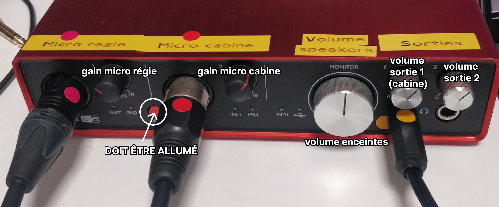

 La différence entre gain et volume

Le gain c'est l'amplitude du signal d'entrée (à quel point le micro capte le son), tandis que le volume c'est l'amplitude du signal de sortie (à quel point les enceintes font du bruit).

On peux ainsi augmenter ou diminuer le gain du micro régie (celui qui permet de communiquer avec la personne dans la cabine) ou du micro cabine (celui qu'on enregistre), le volume des enceintes de monitoring dans la régie, ainsi que le volume du casque de la cabine, et de la seconde sortie si on utilise un casque dans la régie par exemple.

Attention, il faut baisser le volume des enceintes si on utilise le micro régie pour éviter les effets larsen.

Il faut également allumer les enceintes grâce au bouton derrière :
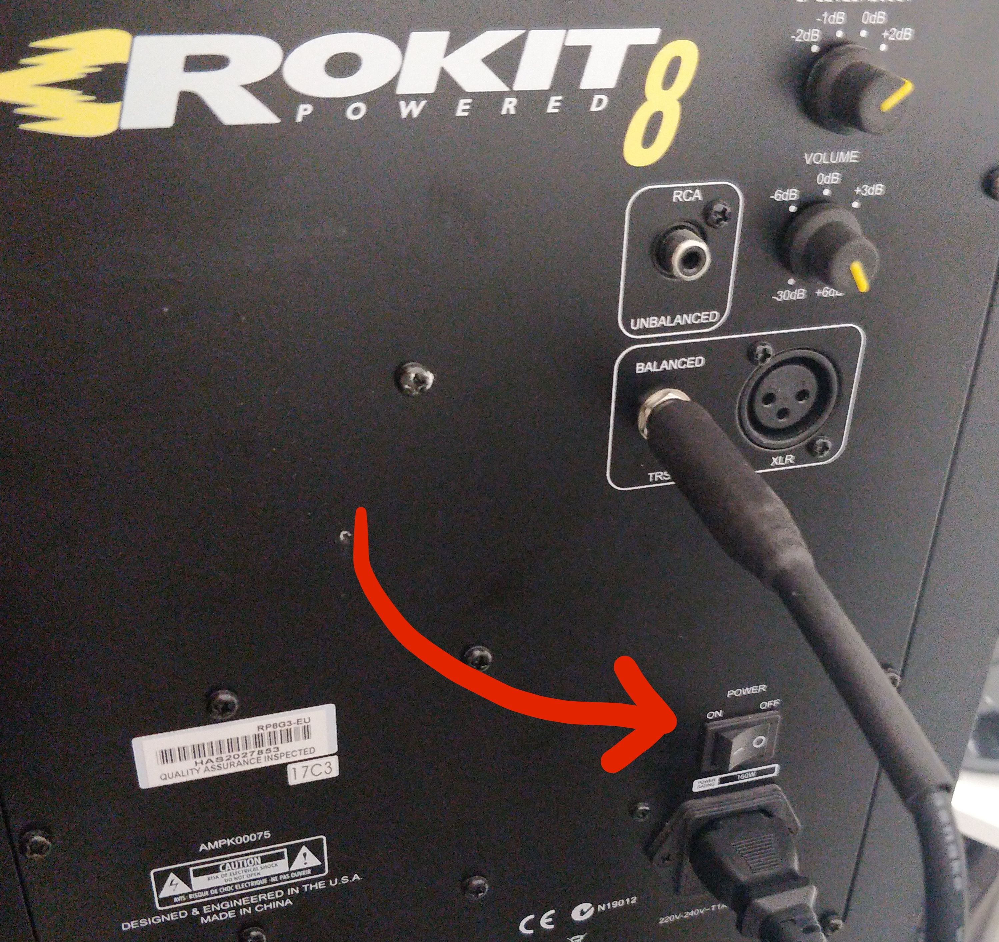

## 2. Enregistrer avec Reaper

Se connecter à l'ordi avec la session ateliernum.

Ouvrir Reaper.

<!-- photo -->

Cliquer sur "Still Evaluating".

Créer un track avec `Track` > `Insert new track`.

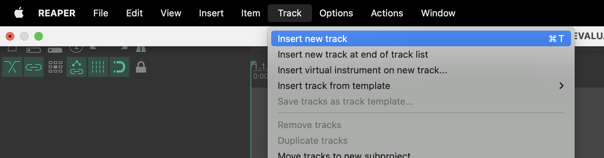

Pour pouvoir enregistrer sur le track, cliquer sur le bouton record ⏺️ sur le track soit en haut à gauche dans la liste des tracks, soit en bas à gauche dans le panneau de mix.

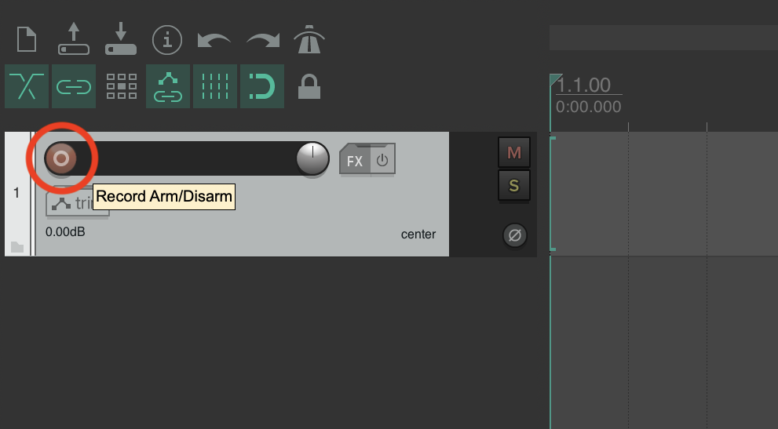
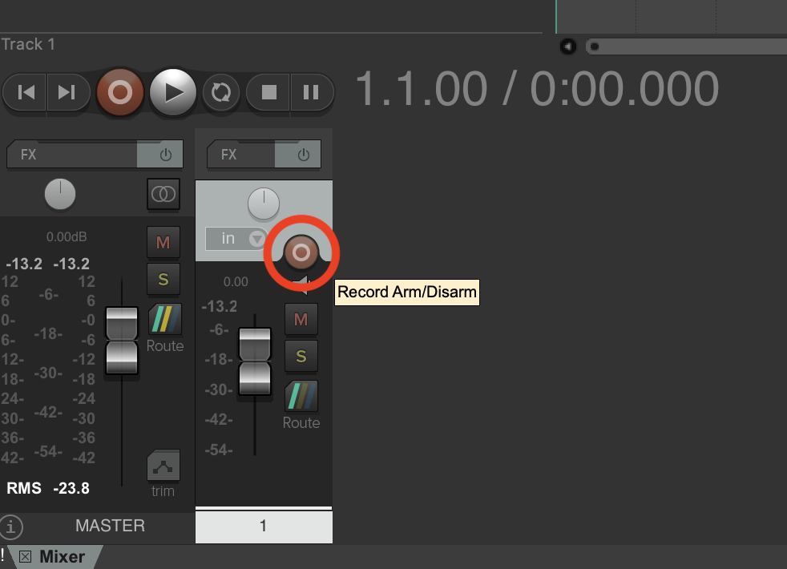

On voit alors le niveau de son du micro dans les vu-mètres.

Pour changer de micro d'entrée (le micro cabine ou le micro régie) qui est enregistré dans le track, cliquer sur la flèche vers le bas ⬇️ dans petit bouton `in`, et sélectionner `Input: Mono` > Left ou Right en fonction de.

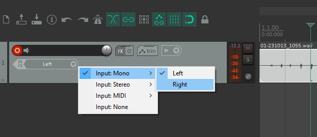

Il suffit alors de cliquer sur le bouton record ⏺️ principal pour enregistrer le son du micro sur le track.

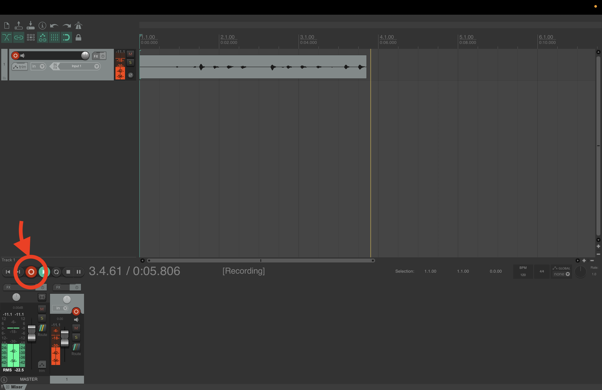

Pour recouper l'enregistrements, on peux soit sélectionner la partie du son à conserver et faire clic-droit > `Crop project to selection`, ou alors sélectionner les parties du son à enlever et faire clic-droit > `Remove contents of selection`.

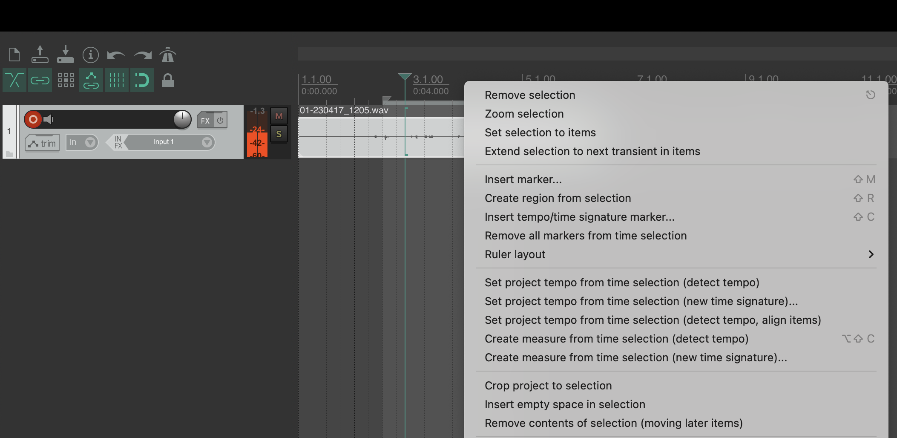

Pour exporter le son, faire `File` > `Consolidate/Export tracks...` .

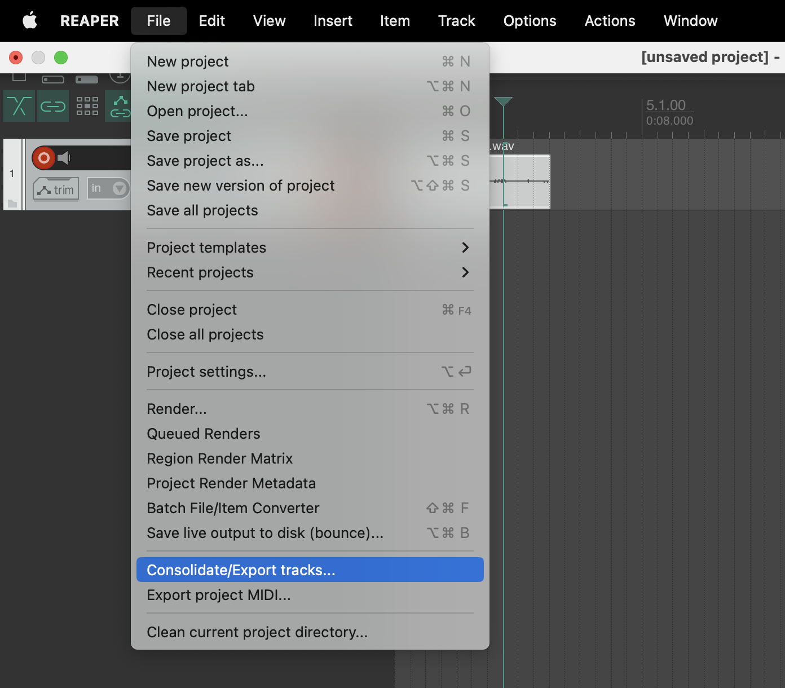

Gérer les réglages de l'export :

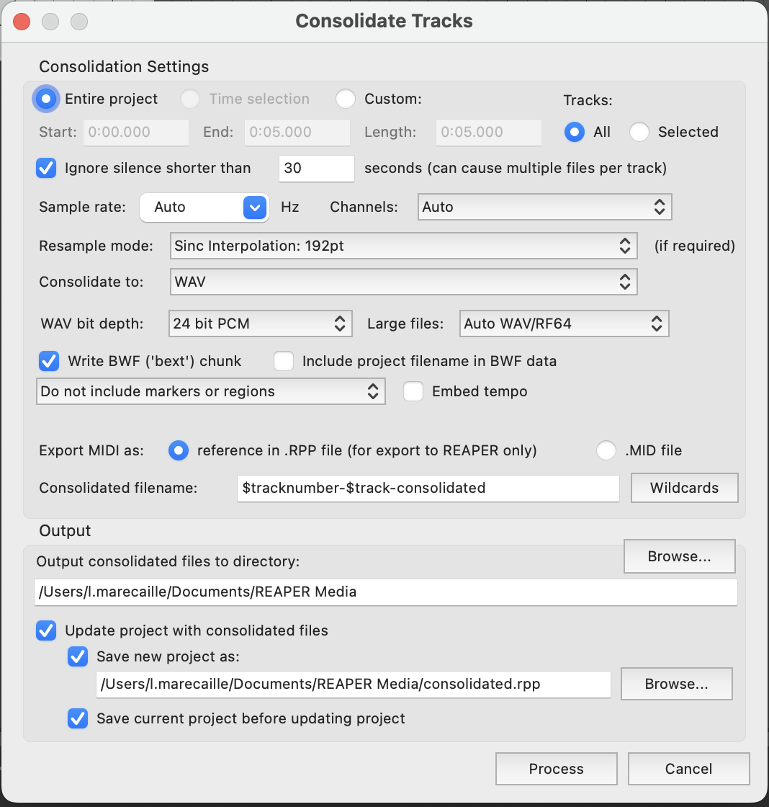

Choisir notamment le format de fichier avec `Consolidate to` (WAV, AIFF, MP3), et l'emplacement de l'export avec `Output consolidated files to directory:`.

## 3. Enregistrer avec FL Studio

Se connecter à l'ordi avec la session ateliernum.

### Réglages FL Studio

Ouvrir FL Studio.

Ouvrir les `Audio Settings` dans la liste `Options`.

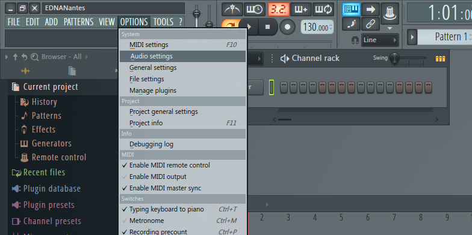

Dans la liste `Device`, sélectionner notre carte son `Focusrite USB ASIO`.

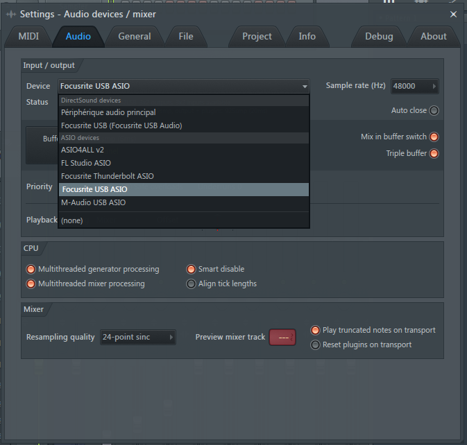

*Attention à bien prendre la Focusrite dans la partie `Asio Device` de la liste.*

Voilà l'interface quand tout est bien connecté :

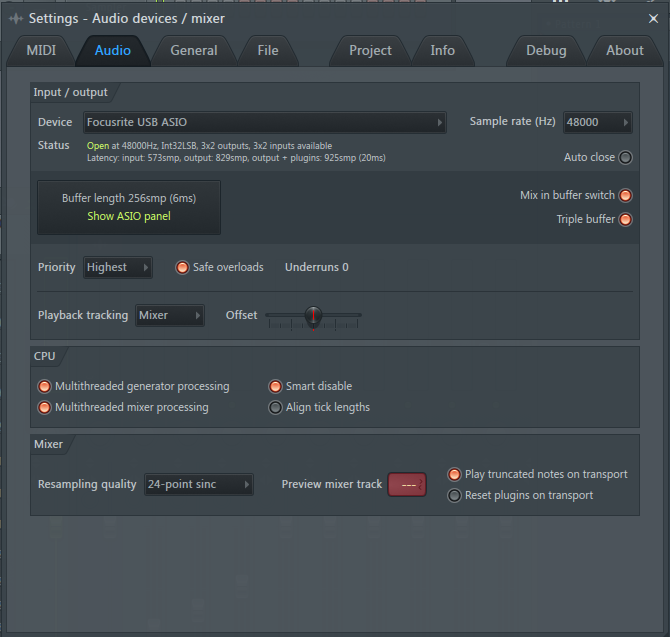

### Enregistrement

Cliquer sur l'icône micro 🎙️ en haut à droite.

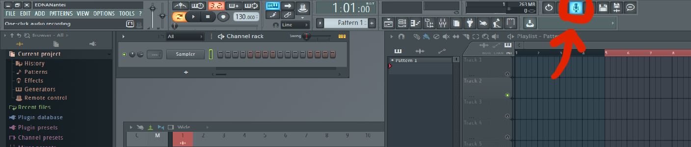

Choisir `Into Edison audio editor/recorder`.

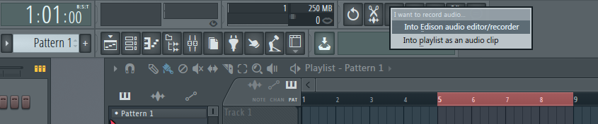

Cliquer sur le bouton enregistrer ⏺️ pour commencer l'enregistrement.

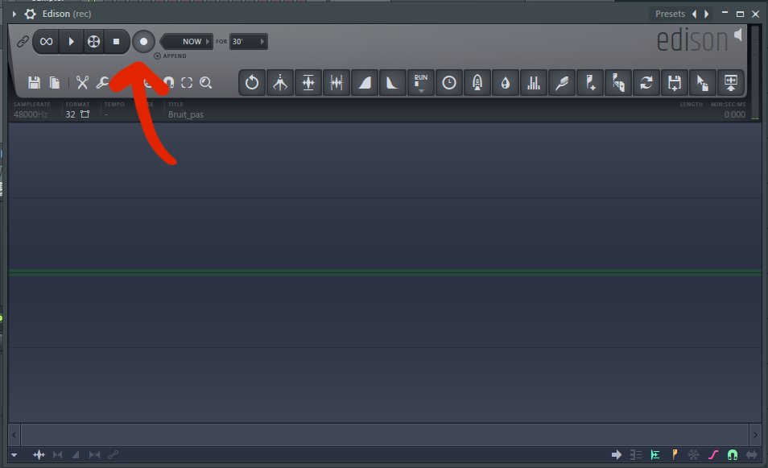

Le bouton enregistrer ⏺️ devient rouge, et on peux cliquer sur le bouton stop ⏹️ pour arrêter.

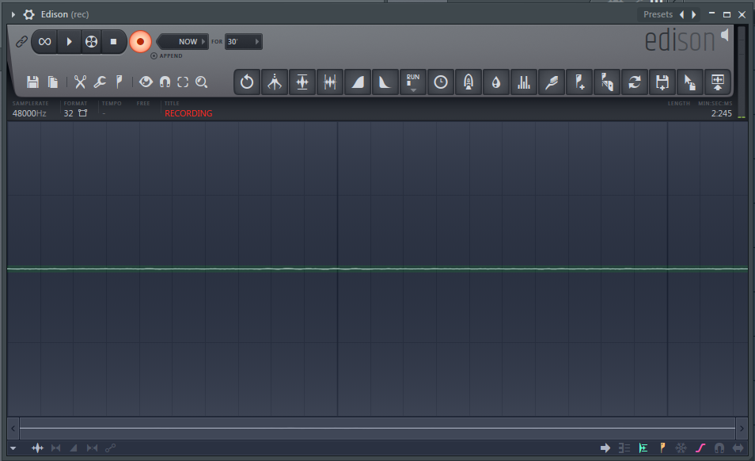

Pour sauvegarder l'enregistrement, cliquer sur le bouton disquette 💾 et choisir `Save sample as`.

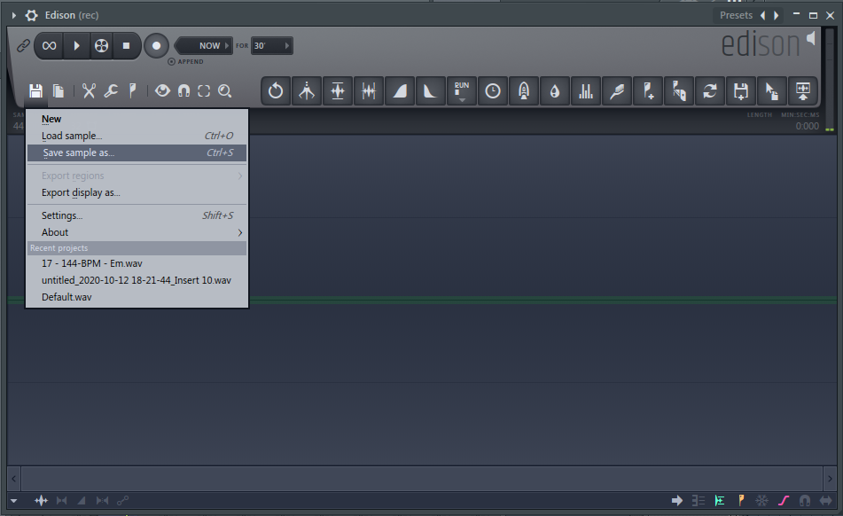

Pour créer un nouvel enregistrement, cliquer sur le bouton disquette 💾 et choisir `New`.

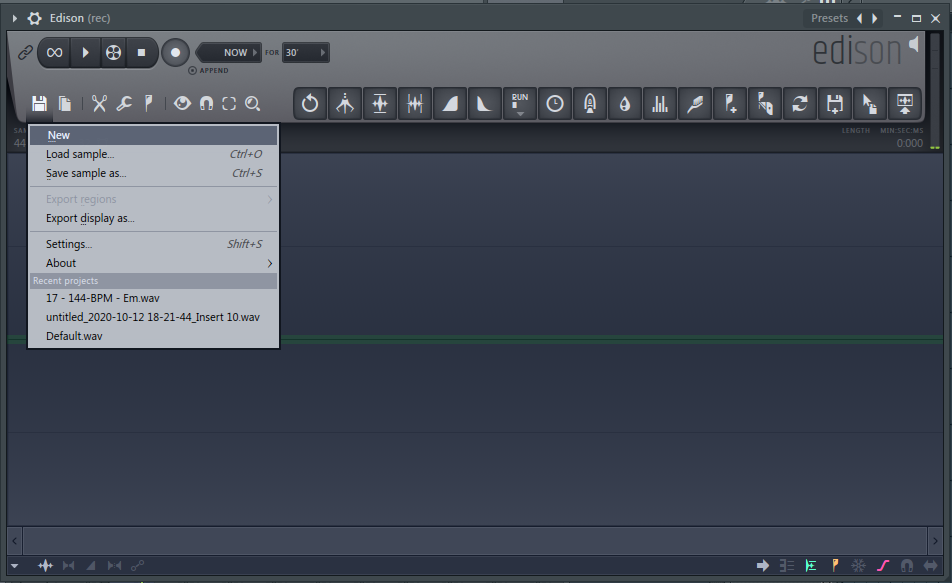

## En cas de problèmes

Avant tout, vérifier si les câbles sont bien branchés en face des entrées de leur code couleur (gommettes) :

Sur la carte son :

Sur les micros régie et cabine :

Sur les prises au mur dans la régie :

Sur les prises au mur dans la cabine :

